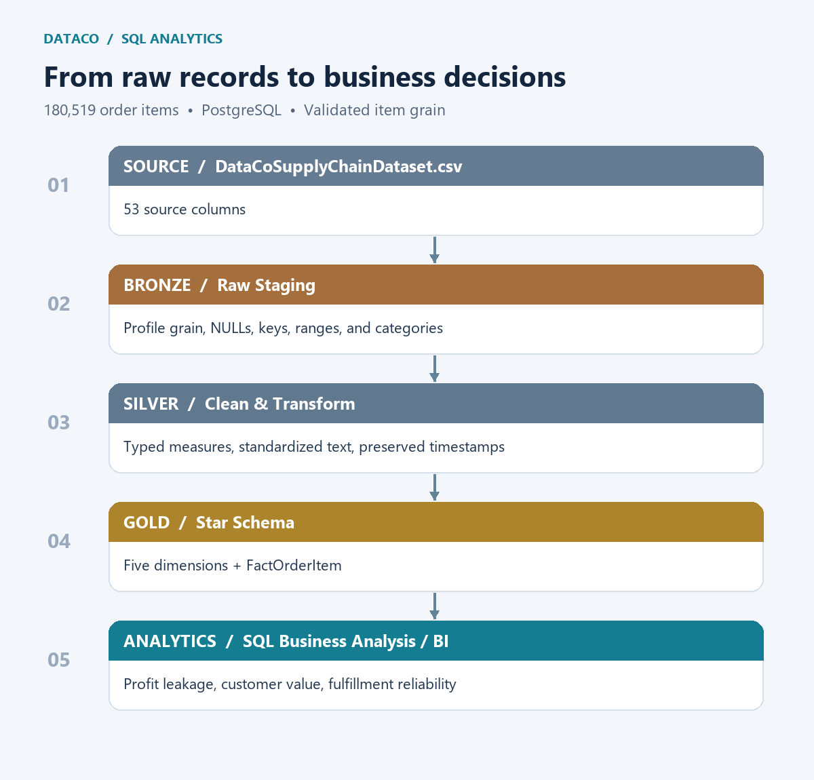
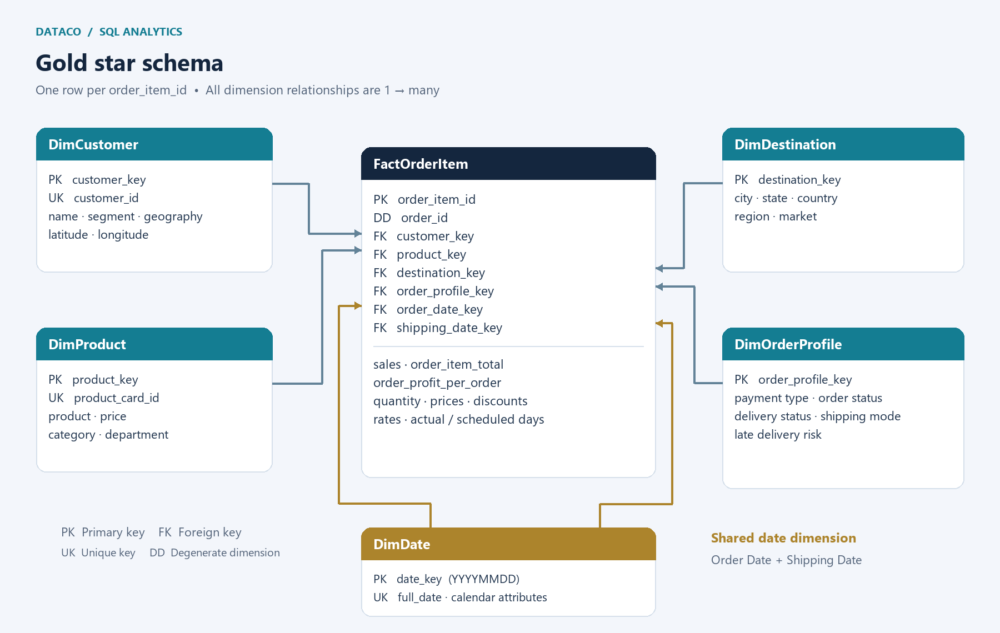

# DataCo Supply Chain Data Transformation & Analytics

**PostgreSQL · Data quality · Dimensional modeling · Decision-support SQL**

An end-to-end SQL project that transforms **180,519 raw order-item records** into a cleaned analytical table and a validated star schema. The work connects data-quality decisions to a model that supports profitability, product concentration, customer value, and fulfillment analysis.

**Validated fact grain: One row per `order_item_id`.**

## Business context and objectives

Supply-chain teams need to understand both commercial performance and service reliability. A flat transaction export makes these questions harder to answer consistently: customer attributes repeat, dates serve different roles, and similar financial fields can be confused.

This project aims to:

- Profile the source before making transformation decisions.
- Clean and type the data without losing the order-item grain.
- Separate descriptive attributes from transactional measures.
- Validate joins and record preservation before analyzing results.
- Identify actionable profit leakage and delivery risks while documenting analytical limits.

## Source dataset

The project uses `DataCoSupplyChainDataset.csv` from the [DataCo SMART SUPPLY CHAIN dataset on Mendeley Data](https://data.mendeley.com/datasets/8gx2fvg2k6/5), by Fabian Constante, Fernando Silva, and António Pereira (2019), DOI: `10.17632/8gx2fvg2k6.5`.

The structured export includes orders, customers, products, geography, commercial measures, and shipping information. The local source has **53 columns and 180,519 order-item rows**. Clickstream data is outside this project's scope. See [data instructions](data/README.md) for attribution, download, encoding, and import details.

## Architecture: Bronze → Silver → Gold

| Stage | Object / output | Responsibility |
|---|---|---|
| Bronze | `bronze.dataco_supply_chain_raw` | Preserve the CSV as text and profile source quality |
| Silver | `silver.dataco_supply_chain_clean` | Clean, standardize, and type the flat analytical table |
| Gold | Five dimensions + `gold.fact_order_item` | Organize an analytics-ready star schema |
| Analysis | Decision-supporting SQL queries | Explain performance, concentration, and operational risk |

BI tools can consume Gold later; the published deliverable is the transformation, dimensional model, and SQL analysis.

## Bronze: profiling before transformation

[01_bronze_profiling.sql](sql/01_bronze_profiling.sql) checks source row count, duplicate `order_item_id` values, fact grain, NULLs, constant columns, key consistency, categorical values, numeric ranges, financial-field relationships, date ranges, and unnecessary or sensitive fields. Date comparisons parse timestamps rather than sorting raw date strings.

| Grain check | Validated result |
|---|---:|
| Total rows | 180,519 |
| Distinct `order_item_id` | 180,519 |
| Duplicate order-item IDs | 0 |

These results confirm **one row per order item**, not one row per order. Customer and product key comparisons test duplicated business identifiers before dimension design.

### Columns removed from Silver

| Column | Reason |
|---|---|
| `customer_email` | Masked and not analytically useful |
| `customer_password` | Sensitive and unnecessary; profiling counts presence without displaying values |
| `order_zipcode` | 155,679 NULL values, approximately 86.2%; other destination geography remains |
| `product_description` | Entirely NULL |
| `product_image` | Unnecessary for SQL analytics |
| `product_status` | Constant, providing no analytical value |

## Silver: cleaning and transformation

[02_silver_transformation.sql](sql/02_silver_transformation.sql) builds `silver.dataco_supply_chain_clean`, retaining the flat structure and validated grain while making fields usable for analysis.

| Field family | Transformation |
|---|---|
| IDs | Trim, convert empty strings to NULL, cast to integer |
| Quantities and shipping days | Convert to integers |
| Monetary measures | Round to two decimals and store as `NUMERIC(12,2)` |
| Discount and profit rates | Preserve four decimals in `NUMERIC(8,4)` |
| Latitude / longitude | Convert to `NUMERIC(10,6)` |
| Order / shipping dates | Parse `MM/DD/YYYY HH24:MI` into timestamps |
| Descriptive text | Trim whitespace and standardize casing where appropriate |
| Customer state | Uppercase to preserve abbreviations |
| Product names, market, region | Preserve meaningful source capitalization |
| Customer postal code | Retain as text because it is an identifier |

Order statuses replace underscores with readable spaces: `PENDING_PAYMENT → Pending Payment` and `SUSPECTED_FRAUD → Suspected Fraud`.

**Timestamps remain in Silver** as `order_timestamp` and `shipping_timestamp`; date-only keys are derived in Gold. The source supplies no timezone, so these represent source-local times rather than globally comparable instants.

### Financial handling

The model retains the source financial fields rather than assuming similarly named measures are interchangeable. Analysis uses `SUM(sales)` for total sales and `SUM(order_profit_per_order)` for net profit. Profit margin is the ratio of these sums, not an average of row-level profit ratios. Despite the source field name, profit is analyzed at the validated order-item grain. Negative profit is retained, not treated as a cleaning error.

## Gold: dimensional model

[03_gold_star_schema.sql](sql/03_gold_star_schema.sql) decomposes Silver into dimensions and a fact table to centralize business attributes, simplify joins, and support consistent filtering and aggregation.

| Table | Purpose |
|---|---|
| `gold.dim_customer` | Customer identity, segment, location, and coordinates |
| `gold.dim_product` | Product, price, category, and department attributes |
| `gold.dim_destination` | Order-destination geography, separate from customer geography |
| `gold.dim_order_profile` | Low-cardinality payment, order, delivery, shipping, and late-risk attributes |
| `gold.dim_date` | Calendar attributes for time analysis |
| `gold.fact_order_item` | Transaction-level measures, identifiers, and dimension foreign keys |

Category and department are **flattened into DimProduct**, keeping a star schema rather than introducing snowflake joins.

### Keys, grain, and relationships

- `order_item_id` is the fact primary key: **one row per `order_item_id`**.
- `order_id` remains in the fact table as a **degenerate dimension**: an order identifier for grouping and drill-through without a separate order dimension.
- Customer, product, destination, and order-profile dimensions use generated `SERIAL` surrogate primary keys. The fact references these keys, while customer and product business identifiers have unique constraints.
- DimDate uses a deterministic integer `YYYYMMDD` calendar key, an explicit exception to sequence-generated surrogate keys.
- Each dimension has a one-to-many relationship to FactOrderItem.
- **DimDate is a shared role-playing dimension**: `order_date_key` and `shipping_date_key` are separate fact foreign keys referencing `gold.dim_date(date_key)`. Queries join it twice, using separate aliases for Order Date and Shipping Date.
- Date coverage spans the minimum and maximum of **both** timestamps, including the final shipping dates.

### Indexes

Explicit indexes cover all six fact foreign keys and `order_id`, supporting filtering and joins. Primary-key and unique constraints also create indexes for item identity and dimension business identifiers. Indexes are implemented; performance gains have not been benchmarked.

### Validation

Gold includes Silver-versus-fact row counts, fact-grain checks, dimension counts, missing foreign-key checks for all six relationships, date coverage checks, and a complete star-schema join sample. Both row counts should be **180,519**, every missing-key count should be **0**, and the item primary key prevents duplicates.

The load uses inner joins: a row-count mismatch is a release-blocking data-quality issue because unmatched source rows could otherwise disappear. Dimension unique constraints intentionally reject inconsistent customer or product attributes rather than silently choosing an arbitrary version.

## SQL business analysis

[04_business_analysis.sql](sql/04_business_analysis.sql) contains **13 final decision-supporting analyses**, selected after exploratory validation. The goal is to answer management questions, not collect dozens of random SQL questions.

The approach uses CTEs, conditional aggregation, `FILTER`, window functions, ranking, cumulative contribution, and safe division with `NULLIF`. Item-based profitability and order-based delivery analysis use different denominators deliberately. Delivery queries aggregate to orders before calculating rates; repeated order attributes must be consistent.

### Key findings

| Metric | Result |
|---|---:|
| Total Sales | **$36.78M** |
| Net Profit | **$3.97M** |
| Profit Margin | **10.78%** |
| Total Orders | **65,752** |
| Loss-Making Item Rate | **18.71%** |
| Total Negative Profit | **$3.88M** in loss magnitude |
| Top 8 products' share of negative profit | **84.64%** |
| Late Delivery Rate | **54.82%** of orders |

- **Prioritize concentrated losses.** Eight products account for most negative profit, providing a focused starting point for profitability review.
- **Separate margin erosion from loss frequency.** Higher discount bands have lower profit margins, but discounts do not materially increase the observed loss-making-item rate. This is an association, not a causal experiment.
- **Separate delivery frequency from severity.** First Class has extremely high late-delivery frequency, but its observed late shipments are only one day late. Second Class combines high late frequency with more severe delays and deserves operational investigation.
- **Qualify the late-2017 trend.** The apparent sales decline coincides with a major collapse in product/category coverage. It should not be interpreted as normal business deterioration without resolving that coverage change.

Total negative profit sums the absolute magnitude of negative item profits; it is distinct from net profit after profitable items offset losses. Dollar notation follows the project's reporting convention; the source does not provide transaction-level currency/FX detail.

## Data limitations

- The dataset identifies **where** profit leakage occurs, but lacks COGS, shipping cost, returns cost, and supplier cost detail needed to fully explain **why** particular transactions lose money.
- Coverage changes constrain time comparisons. Descriptive associations do not establish causality.
- The warehouse is a full-refresh snapshot, not an incremental pipeline or slowly changing dimension implementation.
- Customer attributes are retained locally for modeling; raw data, customer-level result exports, credentials, and database dumps are excluded from the repository.
- Current joins assume populated, consistent dimension attributes. New source versions require profiling again.

## Technologies and skills demonstrated

**Technologies:** PostgreSQL, SQL, CSV, Git, GitHub.

**Skills:** source profiling, data-quality assessment, explicit type conversion, text/date cleaning, financial measure handling, Bronze/Silver/Gold design, dimensional modeling, surrogate and business keys, role-playing dimensions, referential integrity, indexing, analytical SQL, and responsible interpretation of business findings.

- Automate fail-fast data-quality assertions and pipeline execution.
- Add incremental loads and historical dimension handling where business requirements justify them.
- Investigate dataset coverage changes and source lineage.
- Integrate cost, returns, and supplier data to explain negative margins.
- Benchmark query plans and indexes on representative workloads.
- Add an optional BI presentation layer on top of the validated Gold model.
